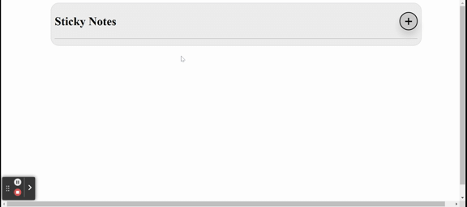

# Sticky notes simple application using Vue3 and localstorage
1. Sticky notes app developed using Vuejs(V3) and simple HTML5/CSS.  
2. User can create multiple notes. 
3. Notes gets saved in to local storage and will be available in multiple sessions. 

# Upcoming release will have
1. Edit Note
2. Delete Note

## Live app on stackblitz 
https://stackblitz.com/edit/sticky-notes-vue-simple-app

# Kickstart
1. checkout the repository
2. npm install
3. npm run dev

## Demo - Sticky notes with localstorage

